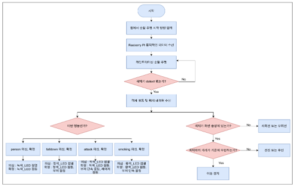
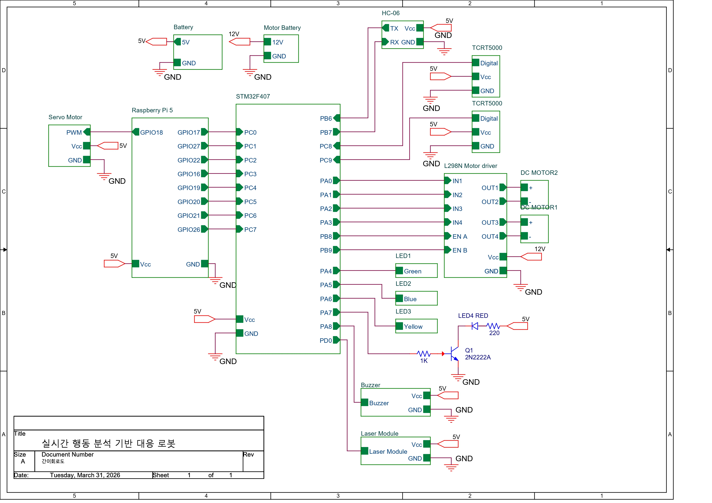
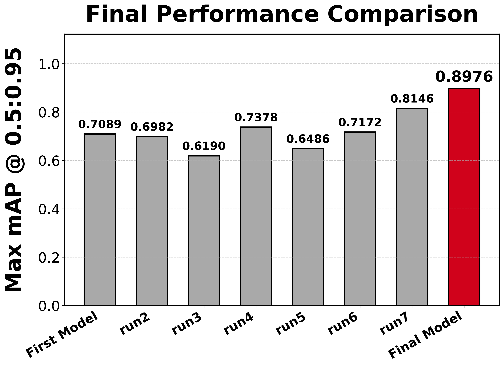
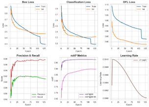
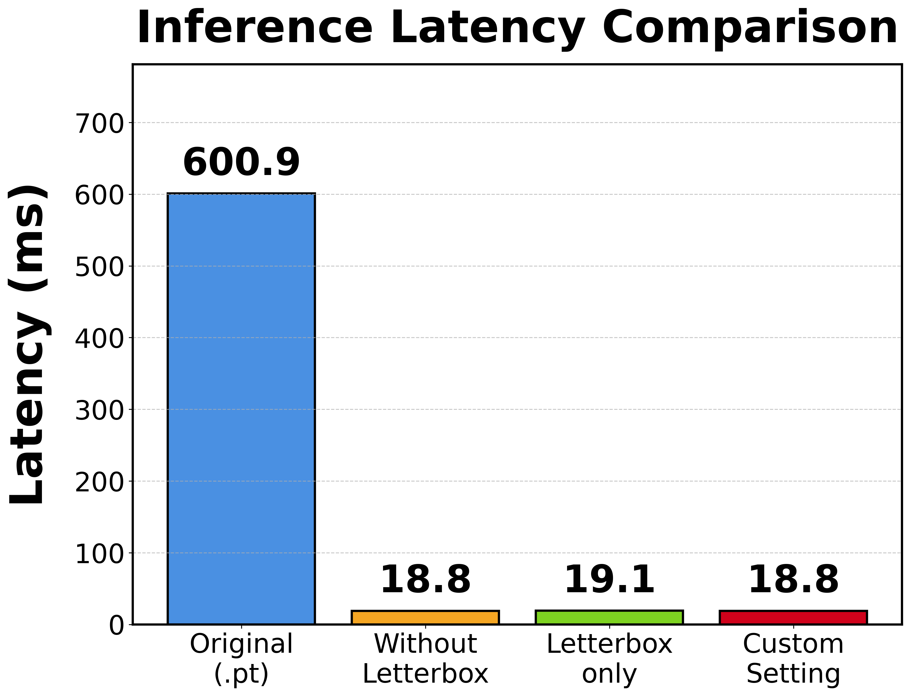
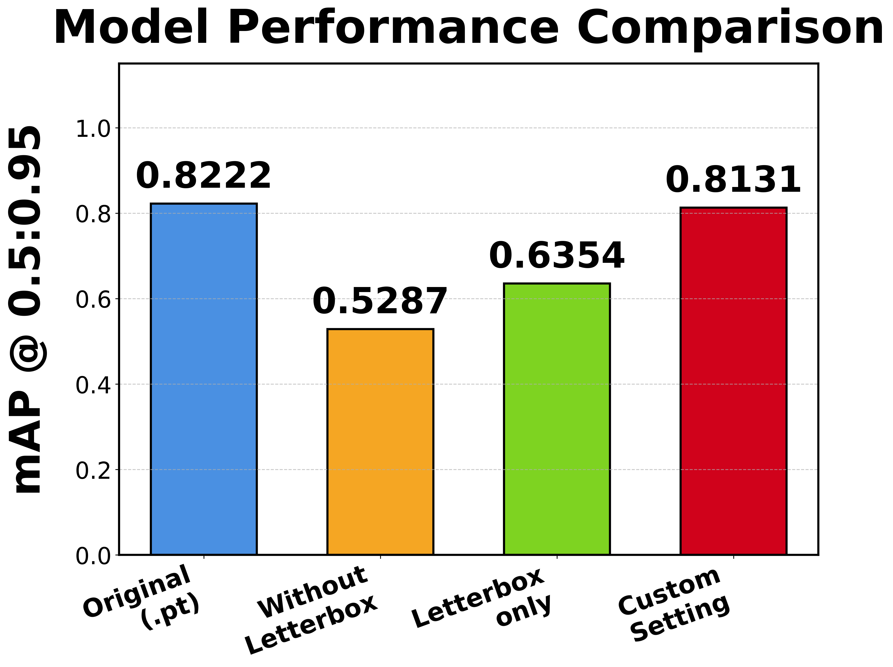
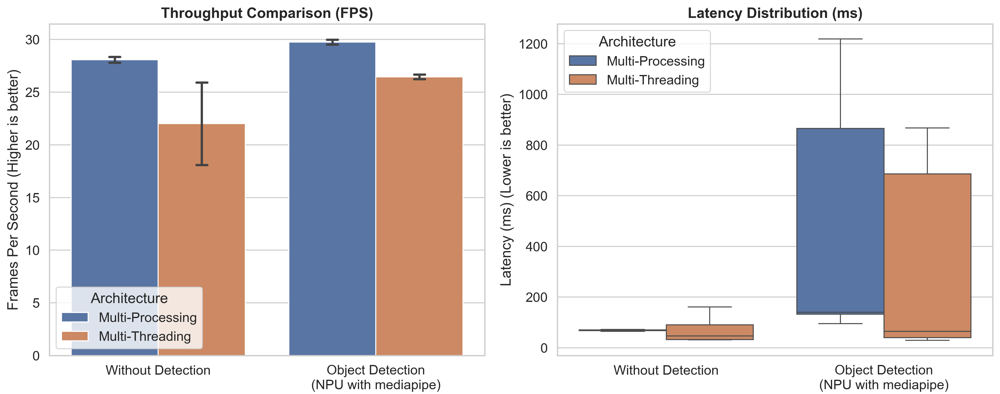

# 온디바이스 엣지 AI 기반 실시간 행동 분석 및 대응 로봇 설계 및 구현
### Real-Time Action Analysis and Response Robot Based on On-Device Edge AI

> 공공장소에서 사람과 이상행동을 실시간으로 감지하고, 이동형 순찰 로봇이 상황에 맞춰 추적·경고·상태 전송까지 수행하는 **온디바이스 AI 로봇 시스템**
>
> **STM32F407 · YOLO11s · Hailo-8 NPU ·  Raspberry Pi 5 · MediaPipe Pose**

학술대회 논문 번호 : KIPS_C2026A0195

---

## 🎯 프로젝트 개요

- **주제**: 사람 및 이상행동(`person`, `falldown`, `attack`, `smoking`) 실시간 탐지 및 대응
- **형태**: 팀 프로젝트 / 온디바이스 AI + 임베디드 제어 + 로봇 시스템 통합
- **기간**: **2026.03.06 ~ 2026.03.20 (약 2주)**
- **목표**: 탐지, 추적, 대응하는 **실시간 순찰 로봇** 구현
- **핵심 과제**
  - Raspberry Pi 5 + Hailo-8 기반 **실시간 온디바이스 추론**
  - MediaPipe Pose 기반 **2차 자세 검증**으로 오탐 감소
  - STM32F407 기반 **주행/경보/외부장치 제어**
  - 웹 대시보드와 앱 연동을 통한 **실시간 모니터링 및 제어**

---
## 📋 목차
- [프로젝트 소개](#-프로젝트-소개)
- [시스템 아키텍처](#-시스템-아키텍처)
- [주요기능](#-주요기능)
- [탐지 클래스 및 로봇 동작](#-탐지-클래스-및-로봇-동작)
- [기술 스택](#-기술-스택)
- [실험 및 성능 평가](#-실험-및-성능-평가)
- [구현 방법](#-구현-방법)
- [트러블슈팅](#-트러블슈팅)
- [담당 업무](#-담당-업무)
- [프로젝트 회고](#-프로젝트-회고)
- [프로젝트 일정](#-프로젝트-일정)

---
## 📌 프로젝트 소개

기존 CCTV 중심 관제 시스템은 고정된 시야, 사각지대, 관제 인력 의존, 그리고 탐지 이후 즉각적인 현장 대응이 어렵다.

이 프로젝트는 이러한 문제를 해결하기 위해, **이상행동을 실시간으로 감지하고 로봇이 직접 반응하는 이동형 AI 순찰 시스템**을 구현한 프로젝트이다.

로봇은 평상시에는 **라인트레이싱 기반으로 순찰 주행**을 수행하고, 객체가 탐지되면 **추적 주행 모드**로 전환된다. 이후 객체의 상태를 분석해 `낙상`, `공격`, `흡연` 등 특정 상황으로 판단되면, 상황에 맞는 **LED / 부저 / 레이저 / 웹 전송** 동작을 수행한다.
<a href="https://youtu.be/D9qzNn8Xx6Q">
  
  고화질 동영상 이미지 클릭시 이동
</a>

 

---

## 🏗️ 시스템 아키텍처

 
 

 로봇 시스템 구성도 

  

 

  
자세한 아키텍쳐

    
   

  

 

  

---

### 1) 실시간 온디바이스 AI 추론
- CPU 기반 실행 대비 **약 26배 빠른 추론 속도**
- **43.9 FPS**, **18.8 ms latency**로 실시간 처리 가능 수준 확보
- Hailo-8 NPU 배포용 **HEF 모델** 최적화 완료

### 2) 정확도와 운영 안정성 모두 고려한 구조
- YOLO11s 단독 탐지 이후, **MediaPipe Pose 기반 2차 검증** 수행
- `attack` / `smoking`처럼 혼동되기 쉬운 클래스의 오탐을 낮추기 위해
  **관절 좌표 + 기하학적 규칙**을 결합한 판단 로직 적용
- track_id 기준 **의심 단계 / 확정 단계** 누적 판별로 순간 오탐 경보 방지

### 3) AI + 임베디드 이중 제어 구조 설계
- **Raspberry Pi 5**: 비전 처리, 객체 추적, 행동 판별, 웹 전송
- **STM32F407**: 모터, LED, 부저, 레이저, 라인트레이싱 등 실시간 하드웨어 제어
- 두 시스템 간 **8-Bit GPIO 병렬 통신 프로토콜** 구현

---

## ✨ 주요 기능

### 1) 실시간 행동 분석
- `person`, `falldown`, `attack`, `smoking` 4개 클래스를 탐지
- YOLO11s + ByteTrack으로 객체 검출 및 추적
- MediaPipe Pose로 33개 랜드마크를 추출해 자세 기반 재판별 수행

### 2) 순찰 및 추적 주행
- 평상시에는 **라인트레이싱 기반 순찰 주행**
- 객체 탐지 시 **위치 기반 추적 주행 모드** 전환
- 상황 종료 후 초기 위치 복귀를 고려한 제어 구조 설계

### 3) 단계적 대응 시나리오
- **의심 단계**: LED 점멸, 추적 또는 접근 시작
- **확정 단계**: LED 점등, 부저/레이저 활성화, 상태 정보 웹 전송

### 4) 관리자 모니터링
- 실시간 영상 스트리밍
- 클래스별 감지 건수 시각화
- 상태 수신 시각, 프레임 수신 시각, FPS 등 대시보드 제공

### 5) 앱 연동 수동 제어
- 스마트폰 앱과 Bluetooth UART 통신
- 수동 주행, 정지, 속도 조절, 비상 동작 등 제어 가능

---

### 탐지 클래스 및 로봇 동작

| 클래스 | 판단 기준 요약 | 로봇 동작 |
|---|---|---|
| `person` | 일반 사람 탐지 및 일정 프레임 이상 유지 | 녹색 LED, 위치 기반 추적 주행 |
| `falldown` | 박스 비율, 몸통 수평각, 어깨-골반 y축 차이 등 | 청색 LED + 부저, 대상 접근, 상태 웹 전송 |
| `smoking` | 손목-입 거리, 팔꿈치 각도 등 | 황색 LED + 부저, 대상 접근, 상태 웹 전송 |
| `attack` | 팔꿈치 각도, 손목 높이, 수평 이동량 등 | 적색 LED + 부저 + 레이저, 위험 인물 추적, 상태 웹 전송 |

---

## 💻 기술 스택

| 구분 | 기술 |
|---|---|
| AI / Vision | YOLO11s, Hailo-8 NPU, MediaPipe Pose, ByteTrack, OpenCV |
| Embedded | STM32F407, Bare-metal C, TIMER, UART, PWM, GPIO, Interrupt |
| Edge Device | Raspberry Pi 5, Raspberry Pi AI HAT+ |
| Backend / Monitoring | Flask, HTTP POST, Web Dashboard |
| App | MIT App Inventor, Bluetooth UART |
| Language | Python, C |
| Hardware | L298N, DC Geared Motor, Servo Motor, TCRT5000, HC-06, USB Webcam |

---

## 📊 실험 및 성능 평가

### 모델 학습 성능

| 항목 | 결과 |
|---|---:|
| Final Model mAP@50-95 | **0.898** |
| 전체 mAP@50 | **0.977** |
| Precision | **0.914** |
| Recall | **0.977** |

### 온디바이스 배포 성능

| 항목 | CPU 기반 (.pt) | Hailo HEF |
|---|---:|---:|
| 추론 속도 (FPS) | 약 1.7 FPS | **약 43.9 FPS** |
| 지연 시간 | 600.9 ms | **18.8 ms** |
| mAP@50:95 | 0.822 | **0.813** |
| 실시간 처리 가능 여부 | 불가능 | **가능** |

> 양자화(INT8)와 배포 최적화 과정에서 정확도 손실을 최소화하면서, 엣지 디바이스 환경에서 실시간 처리 가능한 수준으로 최적화 진행

---

## 🔍 구현 방법

### 1. 2단계 행동 판별 구조
단순 객체 탐지 결과만 사용하지 않고, **YOLO 탐지 결과 + MediaPipe Pose 분석 결과**를 결합해 최종 판단을 수행. 이를 통해 실제 운영 환경에서 중요한 **오탐 억제** 강화

### 2. 멀티프로세스 기반 파이프라인
단일 스레드에서 HEF 추론과 자세 분석을 함께 수행할 경우 FPS가 크게 저하되는 문제를 해결하기 위해
프레임 획득 / 추론 / 포즈 분석 / 하드웨어 I/O를 **코어별로 분리**(멀티프로세싱)

### 3. STM32 Bare-metal 제어
HAL 라이브러리에 의존하지 않고 레지스터 직접 제어 방식으로 펌웨어를 구현해
**예측 가능한 실시간 동작**과 **낮은 제어 지연** 달성.

### 4. 통신 신뢰성 개선
초기 I2C 통신은 Hailo AI HAT 장착 시 간섭 문제가 발생했었다
이를 분석한 뒤 **8-Bit GPIO 병렬 통신**으로 전환하여 하드웨어 간 간섭을 줄이고 통신 안정성 확보

---

## 🔧 트러블슈팅

### 1. 클래스 혼동으로 인한 모델 성능 정체
##### 문제
- 파라미터 튜닝을 반복해도 성능이 개선되지 않고, 일반 상태를 공격 상태로 오분류하는 현상 지속
원인 분석
- 데이터 수집 시 "비슷하면 포함"하는 기준으로 샘플들을 모았자만 애매한 데이터가 클래스간 경계를 흐림
- 데이터셋 전체가 어두운 스튜디오 환경 기반이므로 실제 환경에서 객체 자체를 인식하지 못하는 문제 존재
- 파라미터 튜닝으로 해결 가능한 문제가 아닌 데이터 품질 자체의 문제임을 파악

##### 해결
- 5만 장 전수 조사 후 애매한 샘플 삭제 및 오라벨 재분류
- 다양한 실내외 환경에서 직접 추가 촬영하여 도메인 다양성 확보

##### 결과
- 파라미터 튜닝 없이도 성능 대폭 향상, confusion matrix 개선 확인 → 이후 증강 + 튜닝으로 mAP@0.5:95 = 0.89 달성
 
### 2. HEF 변환 후 객체 미탐지
##### 문제
- YOLO11s → HEF 변환 후 테스트 시 객체 탐지가 전혀 이루어지지 않음. 성능 측정 툴에서는 정상 수치가 나왔으나 실제 카메라 환경에서는 미탐지

##### 원인 분석
- 디버깅 중 카메라를 흔들었을 때 간헐적으로 탐지되는 현상 발견
- 이를 단서로 이미지의 특정 위치/비율에서만 탐지된다는 것을 파악
- 원인을 추적한 결과, Hailo 변환 툴이 캘리브레이션 데이터를 비율 무시하고 강제 리사이즈 처리한다는 것을 확인
- YOLO 학습 시에는 자동으로 letterbox(비율 유지)가 적용되기 때문에 변환 과정에서 이 불일치가 발생함을 인지하기 어려웠음

##### 해결
- 캘리브레이션 데이터에 letterbox 전처리 직접 구현, 바운딩박스 좌표도 동일 기준으로 역변환 적용

##### 결과
- 객체 탐지 정상화

 

### 3. HEF 변환 모델 성능 저하 (optimization level 문제)
##### 문제
- 객체 탐지는 정상화됐으나, 변환된 HEF 모델의 성능이 원본 대비 크게 낮은 상태

##### 원인 분석
- CPU 환경에서 Hailo 변환 시 optimization level이 강제로 최저로 설정됨을 확인

##### 해결
- WSL2 + Docker 환경 구성 후 GPU 인식까지 직접 설정
- optimization level 상향 + 커스텀 하이퍼파라미터 적용

##### 결과
- HEF 모델 성능을 원본 YOLO11s에 근접하게 유지

 

### 4. 실시간 추론 불가 (2~3 FPS)
##### 문제
- 영상 입력 → HEF 추론 → MediaPipe Pose 계산을 단일 프로세스로 처리 시 2~3 FPS로 실시간 동작 불가

##### 원인 분석
- MediaPipe Pose의 연산량이 커 전체 파이프라인의 레이턴시를 증가시킴
- 각 단계가 순차적으로 실행되어 병목 발생

##### 해결
- 멀티스레딩과 멀티프로세싱을 모두 실험, Queue로 프로세스 간 데이터 전달
- 멀티스레딩: MediaPipe 처리 지연은 낮아졌으나 최종 프레임 지연은 오히려 증가
- 멀티프로세싱 채택: MediaPipe 처리 지연이 다소 늘었지만 최종 출력 프레임이 30 FPS에 근접 → 실시간 처리 달성

##### 결과
- 2~3 FPS → 30 FPS 근접, 실시간 동작 확인

---

## ⌨️담당 업무

### YOLO11s 기반 커스텀 포즈 분류 모델 개발
- 데이터 수집
- 5만 장 데이터셋 전수 조사 — 오라벨·애매한 샘플 재분류·삭제
- 다양한 환경에서 직접 촬영을 통한 추가 데이터 확보
- 데이터 품질 개선만으로 파라미터 튜닝 없이 성능 향상
- 클래스 간 혼동(공격, 흡연 등) 원인을 샘플 단위로 분석하고 정제
- 데이터 증강 + 파라미터 튜닝으로 최종 mAP@0.5:95 = 0.89 달성

### Hailo-8 AI 가속기 모델 포팅
**배경**: 엣지 디바이스(Raspberry Pi)에서 실시간 추론을 위해 YOLO11s → HEF 변환 전 과정을 단독으로 수행
1. **객체 미탐지 문제 근본 원인 분석 및 해결** 
- Hailo 변환 툴이 학습 데이터를 비율 무시하고 강제 리사이즈한다는 점을 직접 분석하여 특정
- letterbox 전처리 + 바운딩박스 좌표 역변환을 직접 구현하여 객체 탐지 정상화

2. **포팅 환경 재구성**
- CPU 변환 시 강제 설정되는 최저 optimization level 문제를 파악
- WSL2 + Docker + GPU 패스스루 환경을 직접 구성하여 optimization level 상향
- 커스텀 하이퍼파라미터 적용으로 HEF 모델 mAP를 원본 YOLO11s에 근접하게 유지
- 엣지 환경에서 원본 모델 성능을 최대한 보존한 채 실시간 추론 동작 확인

### 시스템 통합 로직 설계 및 구현
- 영상 입력 → HEF 추론 → MediaPipe Pose 2차 판별 → 행동 확정 → STM 신호 출력 전체 파이프라인 설계
- YOLO 단독 오탐지를 줄이기 위해 MediaPipe Pose를 2차 필터로 도입, 포즈 키포인트 기반 행동 확정 로직 설계
- 일정 프레임 이상 도달시 행동 확정 알고리즘 구현으로 순간 노이즈 탐지 방지
- 멀티프로세싱 + Queue 파이프라인 구현으로 2~3 FPS → 카메라의 한계인 30 FPS을 달성하여 성능 개선
- Raspberry Pi → STM32로 데이터 전송 알고리즘 구현

 

## 🎥프로젝트 회고
#### 배운 점
- 데이터 품질이 모델 성능을 결정한다는 것을 직접 경험 — 라벨 정제만으로 성능이 유의미하게 향상
- AI 가속기 포팅 전 과정(변환 파이프라인, 전처리, 최적화)을 단독으로 수행하며 엣지 AI 배포 실전 역량 확보
- 멀티프로세싱 도입으로 실시간 처리 불가 수준에서 카메라 한계 FPS까지 끌어올림

#### 개선할 점
- 통합 테스트가 늦어져 튜닝 시간이 부족했음. 팀원들과 밤늦게까지 함께 디버깅해 일정 내 동작을 완성했지만, 초기부터 통합 일정을 명시적으로 잡았더라면 더 완성도 높은 결과가 나왔을 것
- 전원 불안정으로 실제 환경에서 성능 저하 발생 → 하드웨어 전력 설계를 초기 단계부터 고려 필요성 인식
- 모델 학습 시간(에포크당 약 10분)이 일정 병목 → 학습 자원과 실험 사이클을 초기에 계획적으로 확보 필요

---

## 📅 프로젝트 일정

> 요구분석부터 최종 검증까지 약 2주간 병렬 개발 방식으로 진행

| 기간 | 주요 작업 |
|---|---|
| 3/6 ~ 3/8 | 요구분석 및 설계, 로봇 HW 인터페이스 설계, 데이터 전처리 시작 |
| 3/9 ~ 3/11 | 기구부 설계 및 프로토타입 제작, 모델 학습 시작 Raspberry Pi 5 프로그램 개발 시작 |
| 3/12 ~ 3/13 | 로봇 주행 시스템 개발, 라인트레이싱 순찰주행 개발, MCU 주변장치 제어 로직 구현, 데이터 전처리 및 모델 학습 |
| 3/14 ~ 3/15 | MCU-휴대폰 UART 통신, MCU-RPi 병렬통신, RPi 전원공급 시스템 개발, 모델 학습 |
| 3/16 ~ 3/17 | 시스템 통합, HEF 모델 변환, 제어 파라미터 튜닝 및 최적화, Final Model 학습 |
| 3/18 ~ 3/20 | 동작 테스트 및 최종 검증, 영상 촬영, 보고서 작성, 최종 제출 준비 |

---

 

<table>
  <tr>
    <td align="center">
      <a href="https://github.com/gammapasta">
        
         
        <b>gammaspasta</b>
      </a>
       
      최준호
    </td>
    <td align="center">
      <a href="https://github.com/KKH2007">
        
         
        <b>KKH4476</b>
      </a>
       
      김광현
    </td>
    <td align="center">
      <a href="https://github.com/haha-hari">
        
         
        <b>haha-hari</b>
      </a>
       
      임하리
    </td>
    <td align="center">
      <a href="https://github.com/SJ00-03">
        
         
        <b>SJ00-03</b>
      </a>
       
      양성준
    </td>
    <td align="center">
      <a href="https://github.com/9donghae">
        
         
        <b>9donghae</b>
      </a>
       
      구동해
    </td>
  </tr>
</table>